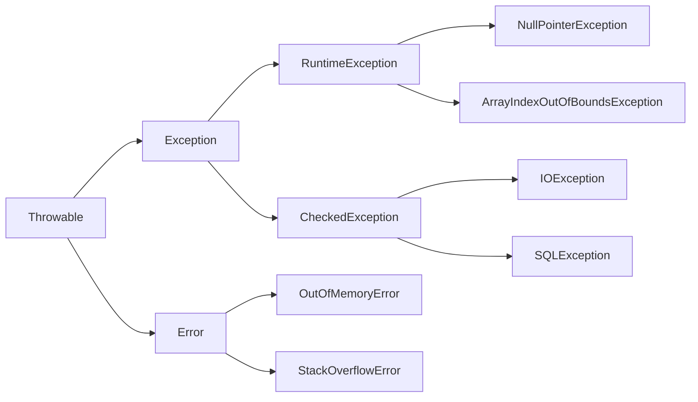

## 基本框架


**非检查型异常**（或运行时异常，继承自`RuntimeException`）：这些异常在编译时不需要被处理，它们通常表示编程错误，如空指针异常（`NullPointerException`）、数组越界异常（`ArrayIndexOutOfBoundsException`）等。`RuntimeException`及其子类都属于非检查型异常，因此它们可以不被`try-catch`块捕获，也不需要使用`throws`关键字声明抛出。
## try-catch块
### 基本框架
```java
try{
// 待检测的程序代码
}catch(异常类型1 异常的变量名1){
// 若为异常类型1采取操作
}catch(异常类型2 异常的变量名2){
// 若为异常类型2采取操作
}finally{
// 无论是否发生异常，finally 代码块中的代码总会被执行，起善后收尾作用。
}```
实例
```java
public class ExceptionTest extends Thread{  
    public static void main(String[] args){  
        System.out.println("Main started");  
        try{Thread.sleep(1000);}  
        catch(Exception e){  
            System.out.println("  Exception caught");  
        }  
        finally {  
            System.out.println(" Finally block");  
        }  
        System.out.println("Main finished" );  
    }  
}
```
### 作用域问题
在Java中，与JavaScript不同，`try...catch`块中的变量作用域遵循Java的块级作用域规则。这意味着在`try`或`catch`块中定义的变量（无论是否显式声明其作用域）都将在该块结束时失去其作用域。

Java中的变量作用域通常是由其声明位置决定的：

- 如果变量是在方法内、但在任何块（如`try`、`catch`、`if`、`for`等）外部声明的，那么它的作用域就是整个方法。
- 如果变量是在某个块（如`try`、`catch`）内部声明的，那么它的作用域就是该块。一旦离开这个块，该变量就不可见了。

使用`final`关键字修饰的变量是一个例外，但`final`的含义是变量的值在初始化后不能被改变，而不是改变其作用域。

下面是一个Java中的例子：

```java
public class ScopeExample {
    public static void main(String[] args) {
        try {
            int x = 10; // x 的作用域仅限于 try 块
            System.out.println(x); // 输出 10
        } catch (Exception e) {
            // 这里不能访问 x，因为它在 try 块的作用域内
            // int y = x; // 这行会编译错误，因为 x 在 try 块内
            int y = 20; // y 的作用域仅限于 catch 块
            System.out.println(y); // 如果 catch 块被触发，输出 20
        }

        // 这里不能访问 x 或 y，因为它们都在 try/catch 块的作用域内
        // System.out.println(x); // 这行会编译错误，因为 x 在 try 块内
        // System.out.println(y); // 这行也会编译错误，因为 y 在 catch 块内
    }
}
```

在这个例子中，`x`在`try`块中定义，因此它的作用域仅限于`try`块。同样，`y`在`catch`块中定义，其作用域仅限于`catch`块。在`try...catch`块外部尝试访问这些变量会导致编译错误。

## throws/throw 关键字

在Java中， throw 和 throws 关键字是用于处理异常的。
throw 关键字用于在代码中抛出异常，而 throws 关键字用于在方法声明中指定可能会抛出的异常类型。在你的代码中，throw new Exception("A custom error occurred");这行代码是在list.size()>1的情况下主动抛出一个异常。这意味着，如果列表的大小大于1，那么你希望程序立即停止，并通知调用者发生了一个错误。这个错误信息就是"A custom error occurred"
### throw 关键字

==throw 关键字用于在当前方法中抛出一个异常。==
格式：创建一个异常对象。封装一些提示信息==(信息可以自己编写)==。这个消息负责告诉调用者；
通常情况下，当代码执行到某个条件下无法继续正常执行时，==可以使用 throw 关键字抛出异常，以告知调用者当前代码的执行状态。==
例如，下面的代码中，在方法中判断 num 是否小于 0，如果是，则抛出一个 IllegalArgumentException 异常。

## 实例
而throw则是用来主动抛出一个异常，转到catch处理。当你的代码遇到了一个错误情况，你希望立即停止当前的操作，并将错误信息传递给调用者，那么你可以使用throw来抛出一个异常。

```java
public void checkNumber(int num) {  
  if (num < 0) {  
    throw new IllegalArgumentException("哥们，数字搞大点");  
  }  
}  //这个异常要是定义好的；

```
### throws 关键字
==throws 关键字用于在方法声明中指定该方法可能抛出的异常,不处理，抛给上层调用者==。当方法内部抛出指定类型的异常时，该异常会被传递给调用该方法的代码，并在该代码中处理异常。
例如，下面的代码中，当 readFile 方法内部发生 IOException 异常时，会将该异常传递给调用该方法的代码。在调用该方法的代码中，必须捕获或声明处理 IOException 异常。

## 实例

```java
public void readFile(String filePath) throws IOException {  
  BufferedReader reader = new BufferedReader(new FileReader(filePath));  
  String line = reader.readLine();  
  while (line != null) {  
    System.out.println(line);  
    line = reader.readLine();  
  }  
  reader.close();  
}  
```

一个方法可以声明抛出多个异常，多个异常之间用逗号隔开。
例如，下面的方法声明抛出 RemoteException 和 InsufficientFundsException：

```java
import java.io.*; 
public class className { 
public void withdraw(double amount) throws RemoteException, InsufficientFundsException 
{ // Method implementation } //Remainder of class definition }
```
# 异常类
==异常类==主要是==用来封装和描述异常情况的==，它们并==不负责处理异常==。异常处理通常在 try-catch 块中进行，或者通过抛出异常到上层方法让其处理。在 catch 块中，你可以获取到异常对象，然后根据异常对象的类型或者其他信息来决定如何处理这个异常。例如，你可以打印出异常信息，或者尝试修复导致异常的问题，或者把异常信息记录到日志中等等。
# 定义自己的异常==类==
```java
  //自定义一个简单的异常类并简单运用  
class MyException extends Exception{  
    public MyException(String message){  
        super(message);  
    }  
}  
  
public class ExceptionTest {  
    public static void main(String[] args) {  
        try {  
            throw new MyException("不好");  
     //自定义异常类时要自己手动抛出，java定义异常类它会隐性自动抛出
        } catch (MyException e) {  
          System.out.println("好");  
            System.out.println(e.getMessage());  
        }  
    }  
}
```