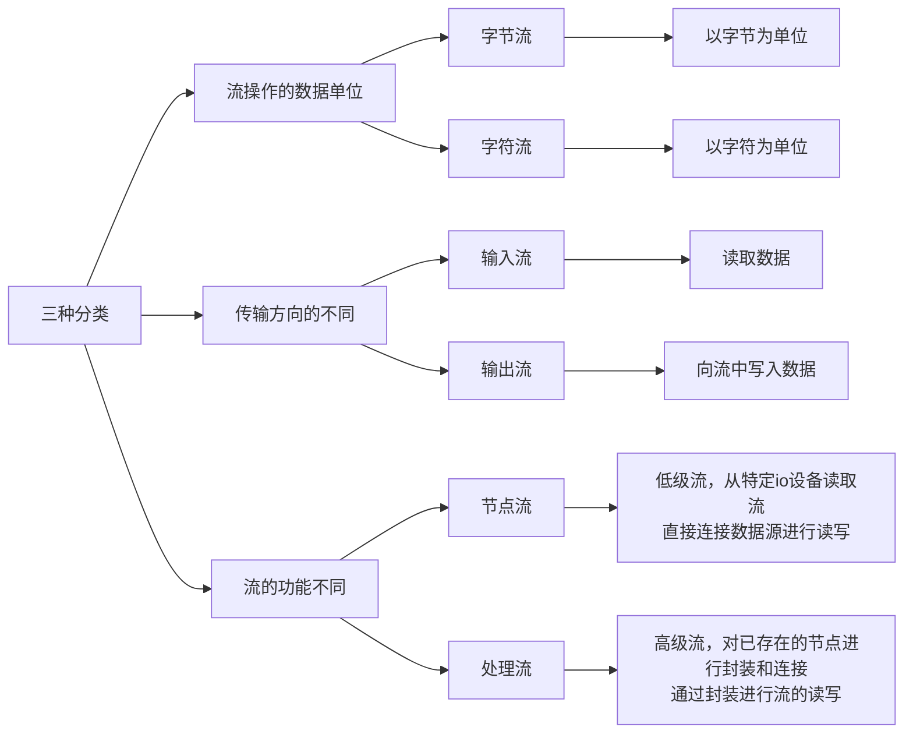
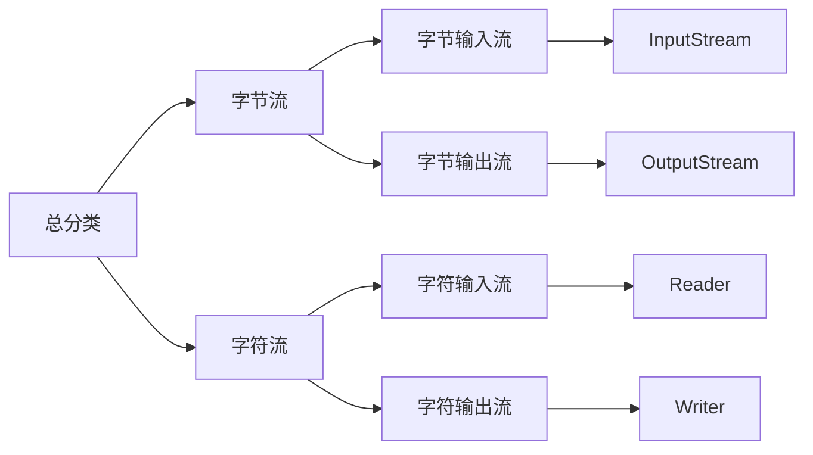

==在JAVA里，流是一些类。==
#### 字节流（Byte Stream）

* 字节流以字节为单位处理数据，不经过字符编码转换，直接处理原始数据。
* 常见的字节流类有：`InputStream`（输入）、`OutputStream`（输出）。

#### 字符流（Character Stream）

* 字符流以字符为单位处理数据，通常用于文本文件操作。
* 字符流内部实际上还是使用字节流来完成数据的传输，但在传输前后会进行字符编码和解码。
* 常见的字符流类有：`Reader`（输入）、`Writer`（输出）。

#### 输入流（Input Stream）

* 用于从数据源（如文件、网络等）读取数据。

#### 输出流（Output Stream）

* 用于将数据写入目标位置（如文件、网络等）。

#### 顺序存取文件（Sequential Access File）

* 顺序存取文件只能按照文件内部的顺序来读写数据，通常不支持直接跳转到文件的任意位置进行读写。

#### 随机存取文件（Random Access File）

* 随机存取文件允许程序直接访问文件的任意位置进行读写操作。
* 在Java中，`RandomAccessFile`类提供了这种功能。

#### 各种派生的流类

* 不同的流类提供了不同的特性和功能，以满足不同的数据处理需求。
* 例如，`FileInputStream`、`FileOutputStream`是字节流的派生类，用于文件操作；`BufferedReader`、`BufferedWriter`是字符流的派生类，提供了缓冲功能以提高读写效率。

###  二进制流和文本流的区别

#### 二进制流（Binary Stream）

* 二进制流主要用于处理二进制数据，如图片、视频、音频等文件。
* 二进制流在读写数据时不会进行字符编码转换，直接以字节为单位处理数据。
* 二进制流支持更广泛的数据类型，可以处理任意类型的二进制数据。

#### 文本流（Text Stream）

* 文本流主要用于处理文本数据，如程序代码、文档等。
* 文本流在读写数据时会进行字符编码转换，如UTF-8、GBK等。
* 文本流通常只处理字符类型的数据，因此不支持直接处理二进制数据。
对于字节流（`InputStream` 和 `OutputStream`）和字符流（`Reader` 和 `Writer`），它们的 `read` 和 `write` 方法具有不同的重载版本，以适应不同的读取和写入需求。由于篇幅限制，我将以表格形式概括这些方法的签名和一般用途，而不是列出所有可能的调用方式（因为那将非常冗长）。
## read与write
### 字节流 (InputStream 和 OutputStream)

#### InputStream 的 read 方法

| 方法签名 | 一般用途 |
| --- | --- |
| `int read()` | 从输入流中读取下一个数据字节。返回读取的字节（0-255之间的整数），如果到达流的末尾，则返回-1。 |
| `int read(byte[] b)` | 从输入流中读取一些字节，并将它们存储到字节数组`b`中。返回实际读取的字节数，如果到达流的末尾，则返回-1。 |
| `int read(byte[] b, int off, int len)` | 从输入流中读取最多`len`个字节的数据，并将它们存储到字节数组`b`中，从索引`off`开始。返回实际读取的字节数，如果到达流的末尾，则返回-1。 |

#### OutputStream 的 write 方法

| 方法签名 | 一般用途 |
| --- | --- |
| `void write(int b)` | 将指定的字节写入此输出流。尽管参数是`int`，但只有低8位有效。 |
| `void write(byte[] b)` | 将`b.length`个字节从指定的字节数组写入此输出流。 |
| `void write(byte[] b, int off, int len)` | 将指定字节数组中从偏移量`off`开始的`len`个字节写入此输出流。 |

### 字符流 (Reader 和 Writer)

#### Reader 的 read 方法

| 方法签名                                      | 一般用途                                                                                           |
| ----------------------------------------- | ---------------------------------------------------------------------------------------------- |
| ==`int== read()`                          | 读取单个字符。==返回作为整数读取的字符，如果到达流的末尾，则返回-1。==                                                         |
| `int read(char[] cbuf)`                   | 将字符读入数组。返回读取的字符数，如果到达流的末尾，则返回-1。                                                               |
| `int read(char[] cbuf, int off, int len)` | 将字符读入数组的某一部分。返回读取的字符数，如果到达流的末尾，则返回-1。                                                          |
| `int read(CharBuffer target)` (Java NIO)  | 将字符读入指定的字符缓冲区。返回读取的字符数，或者如果到达流的末尾，则返回-1。注意这不是`Reader`类中的方法，而是`Readable`接口的一部分，`Reader`实现了这个接口。 |

#### Writer 的 write 方法

| 方法签名                                        | 一般用途                                                                                                                                                                            |
| ------------------------------------------- | ------------------------------------------------------------------------------------------------------------------------------------------------------------------------------- |
| `void write(int c)`                         | 写入单个字符。字符以Unicode码点的形式给出，但实际上只使用了`int`参数的低16位。                                                                                                                                  |
| `void write(char[] cbuf)`                   | 写入字符数组。                                                                                                                                                                         |
| `void write(char[] cbuf, int off, int len)` | 写入字符数组的一部分。                                                                                                                                                                     |
| `void write(String str)`                    | ==写入字符串。==                                                                                                                                                                      |
| `void write(String str, int off, int len)`  | 写入字符串的一部分。                                                                                                                                                                      |
| `void write(CharBuffer cbuf)` (Java NIO)    | 写入字符缓冲区。注意这不是`Writer`类中的方法，但某些`Writer`子类（如`CharBufferWriter`，尽管它不是Java标准库中的一部分）可能提供这样的方法。通常，你会使用`String`或`char[]`的`write`方法，并通过`CharBuffer`的`toString()`或`array()`等方法（如果可用）来桥接。 |

请注意，`CharBuffer`相关的`read`和`write`方法是Java NIO（非阻塞I/O）的一部分，它们与传统的基于字节和字符的I/O流在用法上有所不同。在上面的表格中，我提到了`CharBuffer`以展示字符流与NIO之间的潜在联系，但请注意`Reader`和`Writer`类本身并不直接支持`CharBuffer`作为参数。相反，你可能需要使用`BufferedReader`、`BufferedWriter`或其他类来与NIO缓冲区进行交互。

另外，`read(CharBuffer target)`方法实际上不是`Reader`类中的方法，而是`Readable`接口的一部分，该接口被`Reader`类实现。然而，在标准的Java I/O库中，`Reader`类并没有直接提供接受`CharBuffer`作为参数的`read`方法。相反，你可能需要使用`Channels`和`ReadableByteChannel`（对于字节流）或`ReadableCharChannel`（

### 总结

流提供了一种抽象的数据传输方式，使得程序能够方便地处理各种类型的数据。在选择使用字节流还是字符流时，需要根据实际的数据类型和需求来决定。如果需要处理二进制数据或进行底层的文件操作，通常选择字节流；如果需要处理文本数据或进行文本文件的读写操作，通常选择字符流。
