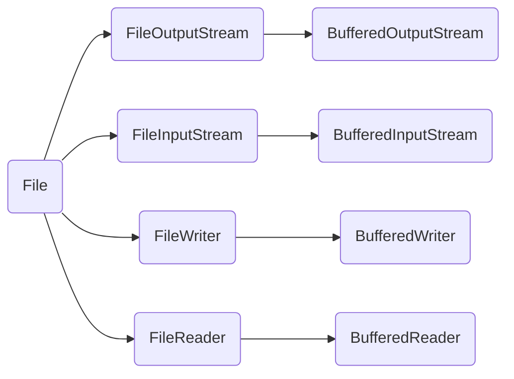

# 外部操作
## **文件名的操作**

|               方法签名                |                  描述                   |
| :-------------------------------: | :-----------------------------------: |
|     `public String getName()`     |              返回文件对象名字符串               |
|    `public String toString()`     | 返回文件名字符串（通常与`getName()`相同，但可能会包含更多信息） |
|    `public String getParent()`    |             返回文件对象父路径名字符串             |
|   `public File getParentFile()`   |    返回表示文件对象父路径的`File`对象（而不仅仅是字符串）     |
| `public String getAbsolutePath()` |            返回文件对象的绝对路径名字符串            |


## **文件属性测试**

|              方法签名              |      描述      |
| :----------------------------: | :----------: |
|   `public boolean canRead()`   |  是否能读指定的文件   |
|  `public boolean canWrite()`   |  是否能修改指定的文件  |
|   `public boolean exists()`    |  指定的文件是否存在   |
| `public boolean isDirectory()` |  指定的文件是否是目录  |
|   `public boolean isFile()`    | 指定的文件是否是一般文件 |
## **一般文件信息和工具**
public long length():返回文件的字节长度；
## 创建删除功能的方法

|                 方法                 |                描述                |
| :--------------------------------: | :------------------------------: |
| ==public boolean createNewFile()== |   当且仅当具有该名称的文件尚不存在时，创建一个新的空文件。   |
|     `public boolean delete()`      |        删除由此File表示的文件或目录。         |
|      `public boolean mkdir()`      |          创建由此File表示的目录。          |
|     `public boolean mkdirs()`      | 创建由此File表示的目录，包括任何必需的父目录（如果不存在）。 |

## 目录操作

| 方法签名                                          | 描述                |
| --------------------------------------------- | ----------------- |
| `public boolean mkdir()`                      | 创建指定的目录           |
| ==public String[] list()==                    | ==返回指定目录下的文件名称==  |
| `public String[] list(FilenameFilter filter)` | 返回指定目录下满足文件过滤器的文件 |
简单示例
```java
//请编写一个程序，分别显示某个目录下所有的文件和所有的目录。  
import java.io.File;  
public class Catalog {  
    public static void main(String[] args){  
        File file =new File("C:\\Users\\W\\Desktop");  
        System.out.println("The list of files and directories in the specified directory are : ");  
      String[] list=file.list();  
      for (String str:list){  
          System.out.println(str);  
      }  
    }  
}
```
```java
//请编写一个程序，分别显示某个目录下所有的文件和所有的目录，以及它们的属性。  
import java.io.File;  
public class Catalog {  
    public static void main(String[] args){  
        File file =new File("C:\\Users\\W\\Desktop");  
        System.out.println("The list of files and directories in the specified directory are : ");  
     File[] subs=file.listFiles();  
     for(File f:subs){  
         if(f.isFile()){  
             System.out.println("File : "+f.getName());  
             System.out.println("Absolute Path : "+f.getAbsolutePath());  
             System.out.println("Size : "+f.length()+" bytes");  
             System.out.println("Last Modified : "+f.lastModified());  
             System.out.println("Readable : "+f.canRead());  
             System.out.println("Writable : "+f.canWrite());  
             System.out.println("Executable : "+f.canExecute());  
             System.out.println();  
         }  
         else if(f.isDirectory()){  
             System.out.println("Directory : "+f.getName());  
             System.out.println("Absolute Path : "+f.getAbsolutePath());  
             System.out.println("Last Modified : "+f.lastModified());  
             System.out.println("Readable : "+f.canRead());  
             System.out.println("Writable : "+f.canWrite());  
             System.out.println("Executable : "+f.canExecute());  
             System.out.println();  
         }  
     }  
    }  
}
```
# 内部操作
## **字节流**输出
`FileOutputStream fos=new FileOutputStream("C:\\Users\\W\\Desktop\\test\\test.txt");`
1.参数是字符串表示的路径或路径的字符串
2.只要有父级路径，没有文件会新建文件；
3.如果文件有内容，则会清空文件；

```java
import java.io.FileOutputStream;  
import java.io.IOException;  
public class FileFunction {
//注意先写完完整方法再写throws异常；
    public static void main (String[] args) throws IOException{  
FileOutputStream fos=new FileOutputStream("C:\\Users\\W\\Desktop\\test\\test.txt");
//参数是字符串表示的路径或路径的字符串
//文件路径注意是两条反斜杠
        fos.write(97);  
//由于是字节流输出，write里面字符是ASCLL码
        fos.close();  
//不close就会占用文件
    }   
}
```
public abstract void write(int b) throws IOException;
public  void write(byte[] b) throws IOException;
public  void write(byte[] b,int off,int len) throws IOException;
# 字符流输出
实例实现文本文件复制
```java
//利用文件输入/输出流完成：将文件exam.java的内容复制到文件test.txt中。  
import java.io.*;  
public class FileCopy {  
    public static void main(String[] args) throws Exception {  
        FileReader fr=new FileReader("crazy.txt");  
        FileWriter fw=new FileWriter("feasible.txt");  
        int ch;  
        while((ch=fr.read())!=-1){  
            fw.write(ch);  
            System.out.print((char)ch);  
        }  
        fr.close();  
        fw.close();
        //如果不关闭可能不能正常写入  
    }  
}
```
## 字节流输入
```java
import java.io.FileInputStream;  
import java.io.IOException;  
public class FileFunction {  
    public static void main (String[] args) throws IOException{   
        FileInputStream fos1=new FileInputStream("src\\test.txt");  
        System.out.println((char) fos1.read());
        //由于是字节流输入，read直接返回的是Acsll码；
        //如果读不到数据则返回-1；  
        fos.close();  
    }  
}
```
public abstract int read() throws IOException;
public  int read(byte[] b) throws IOException;
public  int read(byte[] b,int off,int len) throws IOException;
## **字符流输入**
字节输入流的方法
```java
public abstract int read() throws IOException;
public  int read(byte[] b) throws IOException;
public  int read(byte[] b,int off,int len) throws IOException;
```
```java
import java.io.FileReader;  
import java.io.IOException;  
public class JavaFunction2 {  
    public static void main(String[] args) throws IOException {  
        FileReader fr = new FileReader("src\\test.txt");  
  int ch;  
        while ((ch = fr.read()) != -1)  
        {System.out.print((char) ch);}  
        fr.close();  
    }  
}
```
## **字节输入流和字符输入流Read比较**
```java
 public abstract int read(char[] cbuf,int off,int len){...};//字符输入流第一个参数类型为char[]
 public int read(byte[] b,int off, int len){...};//字节输入流第一个参数类型为byte[],但返回类型都是int
```
# 高级操作
## **字节缓冲区**
缓冲流是对基本流的包装是高级流，但基本功能还是要依靠基本流，所以还是要创建基本流对象。
```java
import java.io.*;  
public class Copy {  
    public static void main(String[] args)throws IOException{  
        BufferedInputStream bis=new BufferedInputStream(new FileInputStream("src\\test.txt") );  
        //注意要创建文件的字节输入输出流
        BufferedOutputStream bos=new BufferedOutputStream(new FileOutputStream("src\\copy.txt") );  
        int b;  
        while((b=bis.read())!=-1){  
            bos.write(b);  
        }  
        bis.close();  
        bos.close();  
    }  
}
```
## **字符缓冲流**
```java
import java.io.*;  
public class Copy {  
    public static void main(String[] args)throws IOException{  
        BufferedReader br=new BufferedReader((new FileReader("src\\test.txt")));  
String s;  
while((s=br.readLine())!=null){  
//注意nextLine的返回值是String类型
    System.out.println(s);  
}  
        br.close();  
    }  
}
```
```java
import java.io.*;  
public class Copy {  
    public static void main(String[] args)throws IOException{  
        BufferedWriter bw=new BufferedWriter((new FileWriter("src\\test.txt")));  
bw.write("你嘴角上扬的样子，百度搜索不到");  
bw.newLine();  
        bw.write("你嘴角上扬的样子，百度搜索不到");  
        bw.close();  
    }  
}
```
==字符流用缓冲流主要因为他们有两个方法，一个是输入的br.readLine()一个是输出的bw.newLine();==  
## **接口和对象串行化**
对象串行化及序列化，也是高级流，需要依附于基础流完成；
对于`ObjectInputStream`（`OIS`）的`readObject()`方法和`ObjectOutputStream`（`OOS`）的`writeObject(Object obj)`方法，它们是Java序列化机制的一部分，用于将对象的状态保存到流中（对象序列化），以及从流中恢复对象的状态（对象反序列化）。由于这两个方法的行为相对特殊，它们不直接对应于字节或字符的读写，而是处理整个对象，因此它们的表示方式也会有所不同。

- ObjectInputStream 的 readObject() 方法

| 方法签名 | 一般用途 |
| --- | --- |
| `Object readObject()` | 从`ObjectInputStream`读取一个对象。此方法阻塞，直到对象图的下一个对象可用，然后返回该对象。返回的对象是之前通过`ObjectOutputStream`的`writeObject(Object obj)`方法写入的对象的一个副本。读取的对象被自动向上转型为`Object`类型，因此可能需要进一步的类型转换以匹配其原始类型。 |

 - ObjectOutputStream 的 writeObject(Object obj) 方法

| 方法签名 | 一般用途 |
| --- | --- |
| `void writeObject(Object obj)` | 将指定的对象写入`ObjectOutputStream`。可以写入的对象包括任何可序列化的对象，即那些实现了`java.io.Serializable`接口的对象，或者其所有字段都是可序列化的对象。在写入对象时，`ObjectOutputStream`会递归地保存对象的整个图（即对象及其引用的所有其他对象）。 |

```java
import java.io.*;  
class Student1 implements Serializable{ 
//注意序列化一定要实现Serializable接口，表示他是可序列化的
    String name;  
    int age;  
    Student1(String name, int age){  
        this.name = name;  
        this.age = age;  
    }  
}  
public class ObjectFunction {  
    public static void main(String[] args) throws IOException,ClassNotFoundException{  
        Student1 s1 = new Student1("张三", 18);  
        Student1 s2 = new Student1("张三", 18);  
ObjectOutputStream oos=new ObjectOutputStream(new FileOutputStream("src\\test.txt"));  
 //与缓冲流同样为高级流，
        oos.writeObject(s1);  
        oos.writeObject(s2);  
        System.out.println((Student1)ois.readObject());  
        oos.close();  
    }  
}
```
## 随机存取文件RandomAccessFile
 在Java中，`RandomAccessFile` 类允许你访问文件的任何部分，而不必从头开始读取或写入整个文件。它==提供了读取和写入文件内容的功能==，就像文件是一个大型字节数组一样。你可以使用 `RandomAccessFile` 来执行类似于文件指针的操作，在文件中的任意位置进行读写.
 ### 构造方法
```java
RandomAccessFile(String name,String mode)
RandomAccessFile(File file,String mode)
```
### 使用方法
接口DataInput
接口DataOutput
在Java中，`RandomAccessFile`（RAF）类提供了对文件内容随机访问的功能。这意味着您可以在文件的任意位置读取或写入数据，而不仅仅是顺序地从头开始。以下是一些`RandomAccessFile`的常用方法，以表格形式展示：

| 方法名称                                         | 描述                                                    |
| -------------------------------------------- | ----------------------------------------------------- |
| `RandomAccessFile(File file, String mode)`   | 使用给定的`File`对象和模式（只读"r"或读写"rw"）创建`RandomAccessFile`实例。 |
| `RandomAccessFile(String path, String mode)` | 使用给定的文件路径和模式（只读"r"或读写"rw"）创建`RandomAccessFile`实例。     |
| `void write(int b)`                          | 将指定的字节写入此文件，并将文件指针向前移动一个字节。                           |
| `void write(byte[] b)`                       | 将`b.length`个字节从指定的字节数组写入此文件，从偏移量`0`开始。                |
| `void write(byte[] b, int off, int len)`     | 将指定字节数组中从偏移量`off`开始的`len`个字节写入此文件。                    |
| `int read()`                                 | 从此文件中读取一个数据字节。如果到达文件末尾，则返回`-1`。                       |
| `int read(byte[] b)`                         | 从此文件中读取最多`b.length`个字节的数据到字节数组`b`中。                   |
| `int read(byte[] b, int off, int len)`       | 从此文件中读取最多`len`个字节的数据到字节数组`b`中，从偏移量`off`开始。            |
| ==void seek(long pos)==                      | ==设置到此文件开头测量起的文件指针偏移量，在该位置发生下一个读或写操作。==               |
| `long getFilePointer()`                      | 返回此文件中的文件指针的当前偏移量。                                    |
| `long length()`                              | 返回此文件的长度。                                             |
| `void close()`                               | 关闭此文件流并释放与此流相关联的所有系统资源。                               |
| `boolean readBoolean()`                      | 读取一个`boolean`值。                                       |
| `byte readByte()`                            | 读取一个字节。                                               |
| `int readUnsignedByte()`                     | 读取一个无符号字节，并将其作为`int`返回。                               |
| `short readShort()`                          | 读取两个字节，并将它们组合成一个`short`值。                             |
| `int readUnsignedShort()`                    | 读取两个字节，并将它们组合成一个无符号的`short`值，并将其作为`int`返回。            |
| `char readChar()`                            | 读取两个字节，并根据修改后的utf-8编码将它们转换为一个字符。                      |
| `int readInt()`                              | 读取四个字节，并将它们组合成一个`int`值。                               |
| `long readLong()`                            | 读取八个字节，并将它们组合成一个`long`值。                              |
| `float readFloat()`                          | 读取四个字节，并将它们组合成一个`float`值。                             |
| `double readDouble()`                        | 读取八个字节，并将它们组合成一个`double`值。                            |
| `void writeBoolean(boolean v)`               | 将一个`boolean`值写入此文件。                                   |
| `void writeByte(int v)`                      | 将一个字节写入此文件。                                           |
| `void writeShort(int v)`                     | 将两个字节写入此文件，该值将被转换为`short`值。                           |
| `void writeChar(int v)`                      | 将两个字节写入此文件，该值将被转换为`char`值。                            |
| `void writeInt(int v)`                       | 将四个字节写入此文件，该值将被转换为`int`值。                             |
| `void writeLong(long v)`                     | 将八个字节写入此文件，该值将被转换为`long`值。                            |
| `void writeFloat(float v)`                   | 将四个字节写入此文件，该值将被转换为`float`值。                           |
| `void writeDouble(double v)`                 | 将八个字节写入此文件，该值将被转换为`double`值。                          |

请注意，上述列表中的某些方法（如`readBoolean()`, `writeBoolean()`等）并不直接映射到文件的字节级读写操作，而是按照Java数据类型的字节表示进行读写。此外，`RandomAccessFile`的读写操作总是从文件指针的当前位置开始，读写后文件指针会自动移动到下一个位置。
*实例*
```java
import java.io.IOException;
import java.io.RandomAccessFile;

public class RandomAccessFileExample {

    public static void main(String[] args) {
        String fileName = "example.txt";
        try (RandomAccessFile raf = new RandomAccessFile(fileName, "rw")) {
            
            // 写入一些数据
            raf.writeBytes("Hello, World!\n");
            raf.writeLong(1234567890L);
            raf.writeChars("这是中文字符\n");

            // 移动文件指针到文件开始位置
            raf.seek(0);

            // 读取数据
            byte[] buffer = new byte[1024];
            int bytesRead = raf.read(buffer);
            String data = new String(buffer, 0, bytesRead);
            System.out.println("读取的初始数据: " + data); // 这可能包含乱码，因为读取了整个缓冲区

            // 移动文件指针到长整型数据的位置
            raf.seek(13); // "Hello, World!\n".length() == 13，假设使用UTF-8编码
            long number = raf.readLong();
            System.out.println("读取的长整型数据: " + number);

            // 假设我们要覆盖一些数据
            raf.seek(0);
            raf.writeBytes("你好，世界!\n"); // 覆盖掉"Hello, World!\n"

            // 再次读取以确认更改
            raf.seek(0);
            bytesRead = raf.read(buffer);
            data = new String(buffer, 0, bytesRead);
            System.out.println("读取的修改后数据: " + data);

        } catch (IOException e) {
            e.printStackTrace();
        }
    }
}
```

> 请注意，在读取和写入时，你需要特别小心文件的编码和字符长度。在上面的示例中，我们假设 "Hello, World!\n" 使用UTF-8编码时占用13个字节，但这取决于实际的字符编码。同样，`readChars()` 方法读取两个字节并转换为字符，这可能不适合所有情况。
另外，`RandomAccessFile` 的性能可能不如专门为大量数据设计的流（如 `BufferedInputStream` 和 `BufferedOutputStream`），因为它提供的功能更为底层。在处理大文件时，请考虑这些性能因素。
```java
/*在当前文件夹下新建一个文件RandomFile.txt，  
向该文件中写入“abcdefghijklmnopqrstuvwxyz”，  
提示用户从键盘输入一个0~25之间的整数，  
根据用户输入的整数，从文件中读取相应的字符并显示。*/  
import java.io.*;  
import java.util.*;  
public class RandomFile {  
    public static void main(String[] args)throws IOException{  
RandomAccessFile raf=new RandomAccessFile("file.txt","rw");  
raf.writeBytes("abcdefghijklmnopqrstuvwxyz");  
Scanner sc=new Scanner(System.in);  
int n=sc.nextInt();  
raf.seek(n);  
System.out.println((char)raf.readByte());  
raf.close();  
    }  
}
```